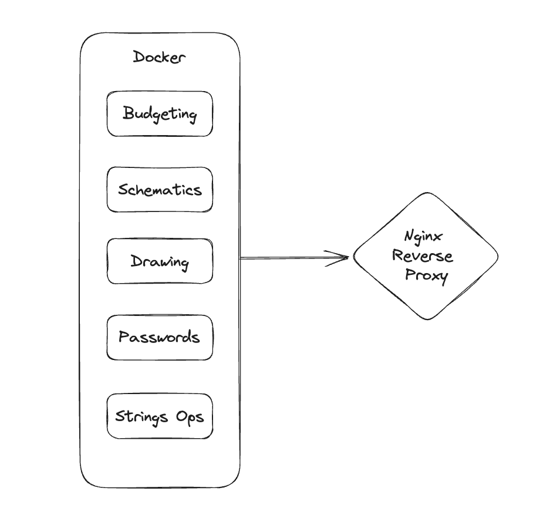

# self-hosted-stack
A set of applications I use almost daily, hosted over my own small server.

## Application List:  
* StackEdit : An multi-functional markdown editor.
* flatnotes : A minimal editor to save day to day notes.
* drawio : Generate flowcharts and schematics.
* actual budget : Track my budget.
* excalidraw : A whiteboard with hand-written feel.
* pwpush : Generate and share passwords.
* string-is : String manipulation functionalites.
* Heimdall : A front-page to access all those apps easily.

## Installation Guide:
1. Install docker and docker-compose on your server/machine.
2. Clone this repo and move into it.
3. Make changes in the docker file (mainly credentials, volumne mounts etc.)
4. Run the following command: `docker compose up -d`

## (Optional) Host on a GCP server.
I am trying to run the whole suite over a minimal GCP server, with the applications visible over a nginx reverse proxy. Each app will be visible at its own subdomain, in order to avoid proxy path issues.
All you need is to create nginx conf files for each app as per the sample file and issue SSL certificates.
If using Nginx, use the following commands:
